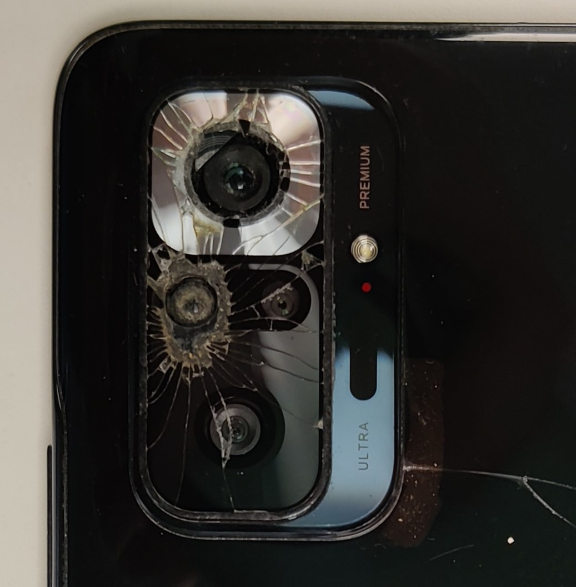
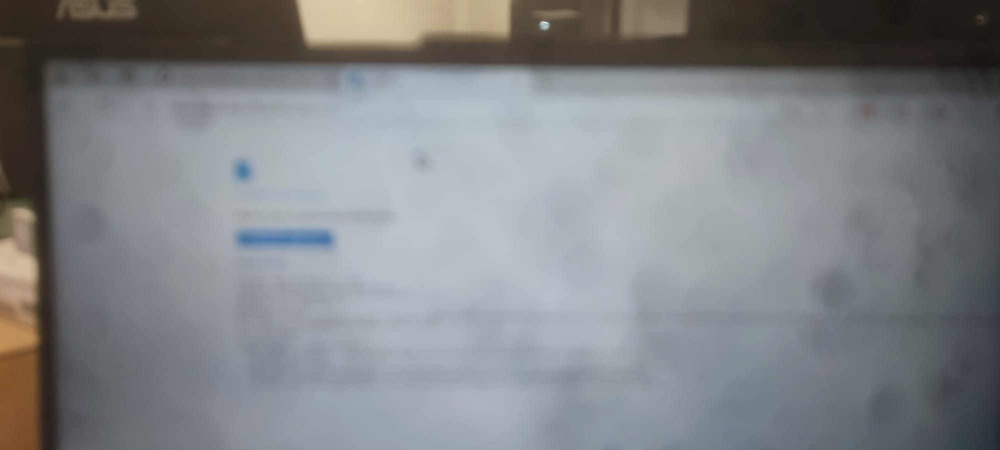

# image-deblurrer
An attempt to make my mobile phone's camera work. Inspired by practical uses of deblurring/deconvolution techniques.

My mobile phone camera is broken (i.e.  ```📉 : (📷 ⊂ 📱) → ⛓️‍💥```); the lens is shattered (photo attached below). In this repository, I investigate how to work around this problem using variational techniques in image processing to restore photos taken with the damaged camera.

<p align="center">
  ,
</p>

Currently, these are my type of photos:

<p align="center">
  ...
</p>

...How do I improve them?

## Project Description

The main goal of this project is to investigate and apply deblurring/deconvolution methods to improve photos taken with a mobile camera that has suffered physical damage, specifically to the lens. The images captured by this camera are blurry due to the damage, and traditional focus correction methods cannot be used due to the lack of precise information about the Point Spread Function (PSF). To address this issue, we explore deblurring techniques, both with known PSF (non-blind deblurring) and without it (blind deblurring), using variational techniques and numerical methods.

## Objective

The goal is to automatically and effectively restore images through deconvolution techniques. This involves:

- **Recovering the PSF (Point Spread Function)** using deblurring methods.
- **Performing the deconvolution** of the damaged images to produce clearer and sharper photos.
- **Evaluating the quality of the restored images** by comparing them with a reference image taken with a working camera.

## Porject overview

* The folder notebook contains the main investigation.
* The folder test_cpp and test_python contain the code utilized.

