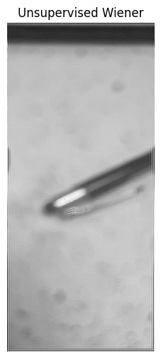
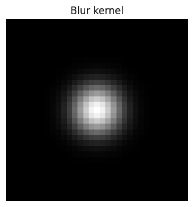
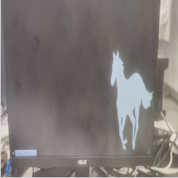

# notebook


This document is a self-contained tutorial/introduction to the basics of image deblurring, through a _hands-on_ approach.   

## Index
## Index
* [Introduction](#Introduction)
* [Testing](#Testing)
    * [Non-blind deconvolution](#non-blind-deconvolution)
        * [Wiener Filter](#wiener)
        * [Modified unsupervised Wiener](#uns-wiener)
        * [Lucy-Richardson](#Lucy-Richardson)
        * [Lucy-Richardson with TV prior](#Lucy-Richardson-TV)
        * [Deconvolution with TV prior](#tvprior)
        * [Deconvolution with hyperlaplacian prior](#hyperlap)
    * [Blind deconvolution](#blind-deconvolution)
    * [Deblurring with DL](#dl-deblurring)
* [References](#References)
    * [C++](#C++)
    * [Python](#Python)
    * [MATLAB](#MATLAB)
    * [Links](#Links)
    * [Books](#Books)

## Some preliminary remarks
1. Natural images have many more (dominate) low frequencies than high frequencies. For example, except for corners and in the absence of impulsive noise, everything in nature tends to be more gradual, and alternating black-and-white patterns do not typically occur.
2. Convolution in the spatial domain is equivalent to multiplication in the frequency domain.

## Introduction <a class="anchor" id="Introduction"></a>

Capturing an image using any type of analog or digital camera, and even through the human visual system, as it is represented in the real and physical world, is impossible due to processes like electronic noise, non-linear lens distortion caused by inherent imperfections, focusing issues, quantization, discretization, noise in the acquisition system, uncontrolled environmental factors, mechanical vibrations, acquisition time, movement of the captured objects, etc. Various degradation phenomena (Noise, scatter, glare, and blur) are discussed in https://temchromatinlab.wordpress.com/deconvolution/. All these sources of error have in common that they cause, in the output image, either the incident light on the sensor to scatter across neighboring pixels, or information from neighboring pixels to combine with each other, disturbing the actual information.

All these factors make images a (pure) approximation of reality, since the problem is ill-posed and information is lost. However, the PSNR is usually so high that "we don't care". Still, there are occasions (see next image) where it is so low that one can call it "degraded." Imagine photographing an infinitely distant light point using an infinitely perfect camera; the resulting image will be a single bright pixel. However, if we photograph a star with our camera, the result is far from being a single bright pixel; instead, we will see a region scattered in a more or less circular shape that decreases in brightness with the radius. The effect that a real image acquisition system has on a "perfect" light source is called the **Point Spread Function** (PSF). 

If the convolution of a perfect image with this PSF produces the real image we would acquire, then by performing the deconvolution of our degraded image with the PSF, we obtain the restored, "ideal" image. Sometimes, the **Optimal Transfer Function** (OTF) is mentioned, which is the counterpart of the PSF in the frequency domain.

Furthermore, after this effect, noise is added to the image due to processes like those mentioned earlier. Sometimes (e.g., space telescopes), it is a poor assumption that the PSF is the same across all pixels in our real image. A degraded image like this is often denoted **blurred**. So, in a basic model, the ```Imaging Process = Convolve(ideal image, PSF) + Noise```. All these factors make PSF estimation theoretically possible, but practically impossible.

### Disambiguation

- **Smoothing**: We try to suppress superfluous features and false discontinuities.
- **Enhancing**: We try to create discontinuities where they should appear.
- **Deblurring**: The process of removing (any kind of) blur from an image. Sometimes deblurring is included as an example of **enhancing**.
- **Deconvolution**: The process of applying the inverse operation of a convolution, often used in restoration and deblurring problems.
- **Sharpening**: The process of improving the perceived acuity and visual sharpness of an image, especially for viewing it on a screen or in print. Sharpening can be used to approximate deconvolution and often provides reasonable results.
- **Super-resolution**: The process of reconstructing missing detail in an image.
- **Upsampling**: The process of increasing the image resolution, with no relation to blur, sharpness, or detail – but aiming to at least not reduce it. Sadly, ML literature calls upsampling “single frame super-resolution”.

### Deconvolution

The deconvolution refers to the mathematical operations used in signal restoration to recover data that has been degraded by a physical process that can be described by the (typically linear) inverse operation of a convolution.

Deconvolution can be one of the most effective methods for performing deblurring. There are other simple image restoration processes via the "Imaging Process", but they might not be very robust in real cases.


Essentially, deconvolution restores high frequencies, but since the captured image contains noise that the "perfect" image does not, the direct deconvolution process can amplify the noise, which also contains high frequencies. One way to look at it is as follows: As is well known, convolution in the spatial domain is equivalent to multiplication in the frequency domain. However, the reverse operation (inverse) of division in the frequency domain is not equal to deconvolution in the spatial domain because there will typically be noise, which will be significantly amplified at high frequencies (even when anti-aliasing is applied). This leads to artifacts or replicas in the recovered image when using deconvolution.

Due to the ill-posedness of the image restoration problem (in general), it is common to concatenate deconvolution and denoising stages to leverage the performance and benefits of each efficient method.

There are several techniques that use deconvolution to deblur signals. Some widely used approaches are:
1. Solve in the frequency domain (e.g., Inverse Filter [i.e., direct deconvolution])
2. Solve in the frequency domain and use regularization to minimize noise (e.g., Wiener Filter)
3. Iterative approaches (e.g., Richardson-Lucy)
4. Iterative approaches with regularization (e.g., Richardson-Lucy with Total Variation Regularization)

### Types of Deconvolution

_**How can we estimate the blur kernel $ H $ if, initially, we can only make assumptions?**_ For example, it could be Gaussian, a row/column vector, sparse, etc. Models such as neural networks, probabilistic approaches, or heuristic knowledge can be used to make a good estimation of $ H $. A very direct exploration method is provided by the PSF if we can identify a point (impulse) in the image, where its degraded version will certainly be the degradation function we're looking for. This way, we could estimate $ H $ approximately by simply observing part of our image, as mentioned in the introduction. Of course, this is easier when photographing a sky than a desk.

Numerous methods can be employed to enhance the quality of a blurred image, commonly referred to as **deblurring**, and both objective and subjective measures can be used to assess the effectiveness of the deblurring process. This process can involve several approaches:
1. **Blind deconvolution**: This method attempts to estimate the Point Spread Function (PSF) "blindly" from the degraded image alone, without any prior knowledge of the blur or the original image. We do not have any assumption about what the PSF might be.
2. **Non-blind deconvolution**: In this approach, a predefined PSF is assumed based on heuristic assumptions or prior formal knowledge, and deblurring algorithms attempt to recover the original image under these assumptions. In the ideal case, we know the PSF or have a very good approximation, so we can restore the image with almost no error (since, in practice, some type of noise will have been added).
3. **Semi-blind deconvolution**: This approach strikes a balance between the blind and non-blind methods. In semi-blind deconvolution, a partially known or estimated PSF is used, often derived from certain constraints or partial prior knowledge, allowing for more flexible recovery of the original image while still accounting for some level of uncertainty about the blur. We only have an assumption about what the PSF could be.

Moreover, one can categorize the types of deblurring based on how the PSF is assumed:
- **Linear Model**.
  - Time / Spatial Invariant Model.
  - Time / Spatial Variant Model.
- **Non-Linear Model**.
  - Time / Spatial Invariant Model.
  - Time / Spatial Variant Model.

We can consider many different kinds of blurring models, and their complexity depends on whether one assumes the image has noise, the PDF is space-dependent, etc. For example, characteristics like the kernel used to model the process (emulating hand shake, out-of-focus camera, etc.). For a complete discussion, see https://disp.ee.ntu.edu.tw/class/tutorial/Deblurring_tutorial.pdf.

One can use very simple kernels (e.g., Gaussian) in developing efficient deconvolution processes to "get by" in many practical cases.

### Variational formulation


We start from the fact that, if the convolution filter involved in the imaging process is known, we can approximately recover the original image from the observed one through deconvolution.

Now, when $ g(x, y) $ is the only thing that is "recognized as known" (i.e., in a realistic case), this becomes the problem of blind deconvolution. In this case, to estimate $ h(x, y) $ and try to recover $ f(x, y) $ as accurately as possible, we can "minimize a loss function" of the type:

$$ \min_{f,h} \left( (g - A(h) \cdot f)^2 + \lambda p_f(f) + \mu p_h(h) \right), $$

Where, in addition to a data fidelity term (likelihood) between the observed (real) image and the generated (deblurred) image via the operator $ A $ dependent on $ h $, we introduce some prior $ p_f(f) $ on the restored image and some prior $ p_h(h) $ on the blur kernel.

It is worth mentioning the fundamental formulation of the deblurring process under the variational framework. Let the inverse image formation process be denoted as $f$. 

Assume that the functional of this problem has a data term chosen as:

$$ D(f | u) = \frac{1}{2} \| A u - f \|_2^2, $$

where $ A $ is the operator of the (assumed linear) direct process, and $ D $ is dictated by the application, in this case, deblurring:  
$ A u = k * u $ (blur kernel).

The question that usually generates the most interest is: **how to model the prior/regularization term in this formulation?** In deconvolution, $ E(u) = \| k * u - f \|_2^2 + \lambda \| Qu \|_2^2 $ (for example), the operator of the regularizer $ Q $ plays the role, on one hand, of moving the small eigenvalues of $ A $ away from zero and, at the same time, leaving the large eigenvalues unchanged. On the other hand, it incorporates the prior (knowledge of the smoothness of the solution) that we have about $ u $.

This aspect is even more widely studied for denoising, although we will not discuss it here.

## Testing

Now that we have some background, we are prepared to implement some algorithm to try improving the quality of my mobile phone's camera.

Here is my original image:

<p align="center">
  ,
</p>

We will test various methods to perform deblurring, mainly through deconvolution, and analyze the results.

### 1) Non-blind deconvolution <a class="anchor" id="non-blind-deconvolution"></a>

We assume that we (perfectly) know the (blur kernel of the) PSF.

For instance, we assume the Imaging Process process is modeled by the following kernel, which is a Gaussian kernel with $size = 33$ and $\sigma = 3$:

<p align="center">
  ,
</p>

Assuming a known kernel, we can test various non-blind deconvolution methods:

#### 1.1) Wiener Filter <a class="anchor" id="wiener"></a>

<p align="center">
  ,
</p>

A general formulation for the Wiener filter is:

$$ W(r) = \left[ \frac{H^*(r)}{|H(r)|^2} \right]^a \cdot \left[ \frac{H^*(r)}{|H(r)|^2 + \frac{c}{\text{SNR}^2}} \right]^{1-a}, $$

where \( a = 1 \) results in the total inverse filter (pure deconvolution), and \( c = 0 \) gives the corrected total inverse filter (with the regularization term, either constant or variable, that prevents division by zero and reduces high-frequency noise amplification).

Here are some results for arbitrary parameters tuned to improve the performance on the particular images:
<style>
  :root {
    --image-width: 256px; 
    --image-height: 256px; 
  }
  .image-cell img {
    display: inline-block;
    width: var(--image-width);
    height: var(--image-height);
    object-fit: contain; 
  }
</style>
<p align="center">
  <table>
    <tr>
      <th>Original Image</th>
      <th>Magnitude of Original Spectrum</th>
      <th>Blur Kernel</th>
      <th>Magnitude of Wiener Filter</th>
      <th>Magnitude of Restored Image</th>
      <th>Restored Image</th>
    </tr>
    <tr>
      <td class="image-cell"></td>
      <td class="image-cell"></td>
      <td class="image-cell"></td>
      <td class="image-cell"></td>
      <td class="image-cell"></td>
      <td class="image-cell"></td>
    </tr>
    <tr>
      <td class="image-cell"></td>
      <td class="image-cell"></td>
      <td class="image-cell"></td>
      <td class="image-cell"></td>
      <td class="image-cell"></td>
      <td class="image-cell"></td>
    </tr>
    <tr>
      <td class="image-cell"></td>
      <td class="image-cell"></td>
      <td class="image-cell"></td>
      <td class="image-cell"></td>
      <td class="image-cell"></td>
      <td class="image-cell"></td>
    </tr>
  </table>
</p>

The result is not satisfactory. Our photos are something _bizarre_; the blurring effect is very intense, and the Wiener filter has limitations under this level of degradation. Additionally, the ringing artifacts caused by not applying adequate windowing to the blur kernel are visible. We do not know what PSF would have my camera. This is trial and error and the time complexity depends directly on the patience and expertise of the user.

#### 1.2) Modified unsupervised Wiener <a class="anchor" id="uns-wiener"></a>
This algorithm has a self-tuned regularization parameters based on data learning. Based on an iterative Gibbs sampler that draw alternatively samples of posterior conditional law of the image, the noise power and the image frequency power.

See [scki-kit doc](https://scikit-image.org/docs/stable/auto_examples/filters/plot_restoration.html) and [paper](https://hal.archives-ouvertes.fr/hal-00674508).

<p align="center">
  <table>
    <tr>
      <td class="image-cell"></td>
      <td class="image-cell"></td>
      <td class="image-cell"></td>
    </tr>
    <tr>
      <td class="image-cell"></td>
      <td class="image-cell"></td>
      <td class="image-cell"></td>
    </tr>
  </table>
</p>

#### 1.3) Lucy-Richardson <a class="anchor" id="Lucy-Richardson"></a>
We start with a certain conjecture of our unknown ideal image; we apply an iterative scheme, updating the estimation until convergence.

... 

#### 1.4) Lucy-Richardson with TV prior <a class="anchor" id="Lucy-Richardson-TV"></a>

By adding an anisotropic regularizer such as the TV operator, the disparity of gradients can be incorporated into the required solution. This, along with the maximization of the MAP that seeks fidelity, can be beneficial for recovering a more natural image, less surrounded by artificial high frequencies.

... 

#### 1.5) Deconvolution with TV prior <a class="anchor" id="tvprior"></a>

... 

#### 1.6) Deconvolution with hyperlaplacian prior <a class="anchor" id="hyperlap"></a>

...

The kernel utilized was specifically designed:

```cpp
cv::Mat kernel = (cv::Mat_<float>(11, 11) <<
                  2, 0, 1, 0, 0, 0, 1, 0, 0, 0, 1,
                  0, 0, 0, 0, 0, 0, 0, 0, 0, 0, 0,
                  5, 0, 2, 0, 1, 1, 4, 0, 3, 0, 3,
                  1, 0, 0, 0, 0, 0, 1, 0, 0, 0, 0,
                  4, 1, 5, 0, 1, 3, 4, 0, 3, 0, 2,
                  0, 0, 0, 0, 1, 6, 2, 0, 0, 0, 0,
                  1, 0, 4, 5, 23, 37, 27, 2, 1, 0, 0,
                  0, 0, 0, 0, 17, 35, 23, 0, 0, 0, 0,
                  0, 0, 0, 0, 4, 9, 5, 0, 0, 0, 0,
                  0, 0, 0, 0, 0, 0, 0, 0, 0, 0, 0,
                  1, 0, 3, 0, 0, 0, 0, 0, 0, 0, 0);
kernel /= 255.0;
```

<style>
  :root {
    --image-width: 256px; 
    --image-height: 256px; 
  }
  .image-cell img {
    display: inline-block;
    width: var(--image-width);
    height: var(--image-height);
    object-fit: contain; 
  }
</style>
<p align="center">
  <table>
    <tr>
      <th>Original Image</th>
      <th>Restored Image</th>
    </tr>
    <tr>
      <td class="image-cell"></td>
      <td class="image-cell"></td>
    </tr>
    <tr>
      <td class="image-cell"></td>
      <td class="image-cell"></td>
    </tr>
    <tr>
      <td class="image-cell"></td>
      <td class="image-cell"></td>
    </tr>
  </table>
</p>

Subtle improvements can be noticed; nevertheless, the text and other visually perceptible elements are still far from being considered restored... At this point, what options do we have left to try? Perhaps **machine learning** tools?... Yes!

### 2) Blind deconvolution <a class="anchor" id="blind-deconvolution"></a>

We intend to find the PSF directly from the degraded image.

#### 2.1) TV blind deconvolution with Split Bregman

Probar este en IPOL https://www.ipol.im/pub/art/2012/g-tvdc/article.pdf

https://www.sciencedirect.com/science/article/pii/S1047320311001659
... 

### Deblurring with DL <a class="anchor" id="dl-deblurring"></a>

Training an ML/DL model for deblurring or deconvolution in a supervised manner could be considered a blind method because the network has no prior knowledge of the PSF and must infer and adjust it based on the training images. However, from another perspective, we are providing the ideal images in a supervised way, making it a much stronger prior than other blind methods. Likewise, due to the inherent ambiguity, it could also be categorized as a semi-blind deblurring/deconvolution method.

Leaving aside the issue of taxonomy, in this section, we will experiment with using a (relatively simple) DL model trained to restore any image.

Using just 5 epochs and a realitvely simple model from [here](https://github.com/aniru-dh21/Image-Deblurring-App), consisting of AE and CNN, trained on the RealBlur Dataset, we obtain the following results (upper row: original, bottom row: deblurred):

<p align="center">
  <table>
      <tr>
        <th>Book</th>
        <th>Key</th>
        <th>Mouse</th>
        <th>Pen</th>
        <th>Screen</th>
        <th>Text</th>
        <th>Things</th>
      </tr>
      <tr>
        <td class="image-cell"></td>
        <td class="image-cell"></td>
        <td class="image-cell"></td>
        <td class="image-cell"></td>
        <td class="image-cell"></td>
        <td class="image-cell"></td>
        <td class="image-cell"></td>
      </tr>
      <tr>
        <td class="image-cell"></td>
        <td class="image-cell"></td>
        <td class="image-cell"></td>
        <td class="image-cell"></td>
        <td class="image-cell"></td>
        <td class="image-cell"></td>
        <td class="image-cell"></td>
      </tr>
  </table>
</p>


There is some change in the coloration of the images, but the deblurring results are not worse than in previous methods. Aside from the challenging task of designing a sufficiently good and effective training set for real-world applications, we see that it is definitely worth investigating the design of more complex models and training them more intensively and dedicatedly.

## References

### C/C++
* https://github.com/y3nr1ng/DeconvLR
* https://github.com/tianyishan/Blind_Deconvolution
* https://github.com/chrrrisw/RL_deconv
* https://github.com/DoubleBiao/fast_deblurring
* https://stackoverflow.com/questions/6558641/wiener-filtering

### Python
* https://scikit-image.org/docs/0.24.x/auto_examples/filters/plot_deconvolution.html
* https://haesleinhuepf.github.io/BioImageAnalysisNotebooks/18a_deconvolution/introduction_deconvolution.html
* https://github.com/sylvainprigent/sdeconv/tree/main
* https://github.com/sovit-123/image-deblurring-using-deep-learning
* https://github.com/nkanven/gan-deblurring
* https://github.com/dongjxjx/dwdn
* https://github.com/axium/Blind-Image-Deconvolution-using-Deep-Generative-Priors
* https://github.com/Tmodrzyk/richardson-lucy-python
* https://github.com/scikit-image/scikit-image/blob/main/skimage/restoration/deconvolution.py#L142ç
* https://github.com/agarnung/Image-Deblurring-App

### MATLAB
* https://es.mathworks.com/help/images/deblurring-images-using-a-wiener-filter.html
* https://es.mathworks.com/help/images/deblurring-images-using-a-regularized-filter.html
* https://es.mathworks.com/help/images/deblurring-images-using-the-lucy-richardson-algorithm.html
* https://es.mathworks.com/help/images/deblurring-images-using-the-blind-deconvolution-algorithm.html
* https://es.mathworks.com/help/images/deblur-with-the-blind-deconvolution-algorithm.html

### Links
* https://biapol.github.io/PoL-BioImage-Analysis-TS-GPU-Accelerated-Image-Analysis/30_Deconvolution/0_intro_to_decon.html
* https://disp.ee.ntu.edu.tw/class/tutorial/Deblurring_tutorial.pdf
* https://bartwronski.com/2022/05/26/removing-blur-from-images-deconvolution-and-using-optimized-simple-filters/
* https://temchromatinlab.wordpress.com/deconvolution/
* https://en.wikipedia.org/wiki/Deconvolution
* https://github.com/subeeshvasu/Awesome-Deblurring
* https://networknomad.hashnode.dev/recovering-sharpness-a-comprehensive-exploration-of-image-deblurring-techniques-leveraging-deep-learning
* https://debuggercafe.com/image-deblurring-using-convolutional-neural-networks-and-deep-learning/
* https://towardsdatascience.com/how-to-de-blur-images-without-training-neural-networks-72f8597c0014
* https://medium.com/@saiwadotai/what-is-the-image-deblurring-deep-learning-method-b40621406ae3
* https://networknomad.hashnode.dev/recovering-sharpness-a-comprehensive-exploration-of-image-deblurring-techniques-leveraging-deep-learning

### Books
* Algorithms for Image Processing and Computer Vision 2nd ed. J.R. Parker (p. 251)
* Mathematical Problems in Image Processing (p. 128)

### Courses
* Mery, D. (2020, October 29). 22 Procesamiento de Imágenes: Deconvolución en restauración de imágenes y PSF. [Video](https://www.youtube.com/watch?v=Iw7I2Jnctq4&list=PLilWJnCHHGl2MECnUo0REYid7ZB7jNiHd&index=22&ab_channel=DomingoMery) 
